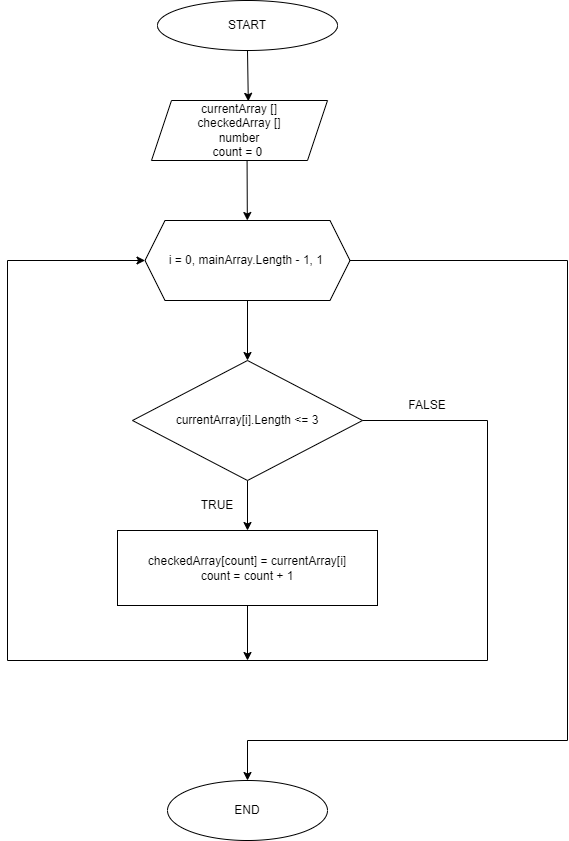

# Контрольная работа первого блока обучения Geekbrains. Разработчик

## Условие задачи:

Написать программу, которая из имеющегося массива строк формирует массив из строк, длина которых меньше, либо равна 3 символа. Первоначальный массив можно ввести с клавиатуры, либо задать на старте выполнения алгоритма.

## Описание работы программы

 1. Получить массив строк.
 2. Вывести массив в консоль.
 3. Подсчет количество элементов, удовлетворяющих условию задачи.
 4. Создание нового массива для сохранения данных, с длиной согласно пункту 3.
 5. Алгоритм заполнения нового массива по условию.
 6. Вывод нового массива в консоль.

## Описание основного метода по заполнению нового массива:

1. Создаем цикл для проверки каждого элемента массива.
2. Проверяем условие количества символов в элементе меньше или равно *number* (в данном случае 3).
3. Заполняем новый массив в случае соответствия условия и/или переходим к следующему элементу массива.

>Блок-схема основного метода:

>Задачие выполнил: Сидоренко Сергей,
>студент курса Разработчик